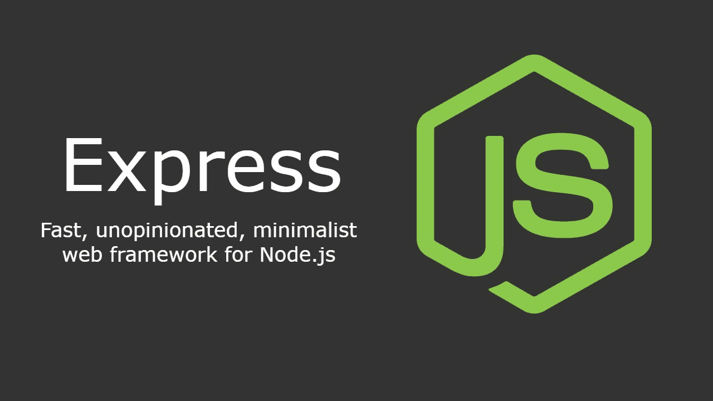

# express-minimal-boilerplate
Boilerplate for minimal express.js app

---

# What is Express.js?

Express.js, or simply Express, is a back end web application framework for building RESTful APIs with Node.js, released as free and open-source software under the MIT License. It is designed for building web applications and APIs.[3] It has been called the de facto standard server framework for Node.js.[4]

The original author, TJ Holowaychuk, described it as a Sinatra-inspired server,[5] meaning that it is relatively minimal with many features available as plugins. Express is the back-end component of popular development stacks like the MEAN, MERN or MEVN stack, together with the MongoDB database software and a JavaScript front-end framework or library

[https://en.wikipedia.org/wiki/Express.js](https://en.wikipedia.org/wiki/Express.js)
